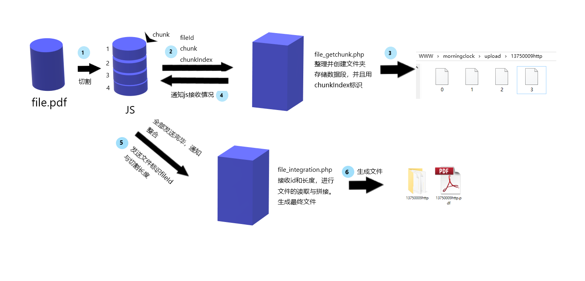

# 文件/大文件上传功能实现（JS+PHP）

> 
>
> 参考博文：[掘金-橙红年代  前端大文件上传](https://juejin.im/post/5cf765275188257c6b51775f)
>
> [路漫漫 其修远 PHP + JS 实现大文件分割上传](https://www.cnblogs.com/rendd/p/10303560.html)
>
> 本文是学习文件上传后的学习总结文章，从无到有实现文件上传功能，前端小白写的代码不是最优，如果有错误的地方请多多指教，如果本文对你有所帮助，深感荣幸。
>
> 

​	近期公司的项目中，涉及到上传大文件的问题，大文件上传用普通表单上传时出现的问题是，无法断点续存，一但中途中断上传，就要重头开始，这很明显不是我们想要的，所以经过一番查询，学习了一下大文件分割上传的方法。并且使用简单的`php`做服务端处理程序实现一个功能demo，供以后回顾使用。本人也是初出茅庐的前端小白，记录下各种功能的实现总结，代码有错误的地方，请多多指正。


## 1.简单文件上传

- ### 普通表单上传

  表单上传是我们经常使用的功能，而且使用起来也是非常简单，我们只需要声明表单内容类型为`enctype="multipart/form-data"`,表明表单上传文件的二进制数据。

  ```html
  <form action="index.php" method="post" enctype="multipart/form-data">
  	<input type="file" name="myfile" />
  	<input type="submit" value="上传" />
  </form>
  ```

  点击上传按钮，就可以将表单发送到服务器，并使用`index.php`接受到对应的表单数据，存入`$_GET/$_POST`超级全局变量中，我们只需要使用`move_uploaded_file`方法，将接收到的文件数据，存储起来，就实现了文件上传功能了。

  ```
  $myfile = $_FILES['myfile'];
  //上传路径
  $path = "upload/" . $myfile['name']; 
  if(move_uploaded_file($myfile['tmp_name'], $path)){
    echo "上传成功";
  } else{
    echo "上传失败";
  };
  ```

- ### ajax模拟表单上传文件

  当我们有需求，需要异步提交表单或者需要对上传文件做一定修改（例如：裁剪尺寸）时，普通的表单上传就不能满足我们的需求，因为我们无法修改表单的file值，这时候就需要ajax出场了。这里我们使用jQuery使用ajax更方便快捷。

  我们需要做如下修改：

  - #### `HTML`

    我们不需要配置form，只需要配置相应的ID，用于获取DOM元素对象。

    ```html
    <form id="myForm">
      <input type="file" name="myfile" id="myFile" />
      <input type="submit" value="上传" id="submitForm"/>
    </form>
    <script src="http://code.jquery.com/jquery-1.11.1.min.js"></script>
    ```

  - #### `JQuery`

    注意，`jQuery`的ajax方法，会默认配置一些请求信息，所以我们需要重新配置放置`jQuery`的默认行为导致数据格式或请求头信息出现问题。

    这里的`contentType`和`processData`为必须项。

    ```javascript
    $('#submitForm').on('click', function(e){
      // 阻止默认表单提交
      e.preventDefault();
    
      // 创建表单
      // 默认配置了enctype="multipart/form-data"
      var formData = new FormData();
      formData.append('myfile',$('#myFile')[0].files[0])
    
      // 提交表单
      $.ajax({
        type: "POST",
        url: 'post.php',
        data: formData,
        // 阻止jquery赋予默认属性，使用FormData默认配置enctype="multipart/form-data"
        contentType: false,
        // 阻止jquery自动序列化数据
        processData: false,
        success: function(data){
          console.log('请求正常',data);
        }
      })
    })
    ```

    

## 2.大文件分割上传

- ### 简单上传痛点

  简单上传，使用表单提交文件到服务器时，如果网络不好或者中途中断，会使文件上传失败，试想一下如果要上传文件很大，当你上传到99%时，突然间中断，又要重新上传，那该有多崩溃，那时你可能电脑的想砸了。

  

- ### 实现思路

  大文件上传，实现的方法，就是将上传文件的二进制文件通过分割的形式，逐个上传到服务器，在上传完成后，服务器再对文件进行拼接操作。

  为了能识别上传的数据，是哪个文件，我们必须要拥有一个`文件标识符`，用于识别接收到的文件数据是属于哪个文件的，以及可以实现避免重复上传，实现秒传功能等。

  不要忘记由于是异步操作，而且操作的数据段大小不一，会导致整合时无法确认拼接熟悉怒，所以我们需要一个index标识数据段的位置。

  通过初步整理，我们就需要以下的参数

  1. 文件唯一标识符
  2. 分割后数据段
  3. 分割数据段的顺序索引值

  经过思考，我们可以建立两个处理程序，来分别处理接受chunk数据段和合并chunk数据段。

  1. `file_getchunk.php`

     功能：将分割chunk数据，整理并保存，此处我们用文件形式实现。

  2. `file_integration.php`

     功能：接收到整合通知，将数据段拼接，并生成文件。

  整体流程大致如图：

  

- ### PHP.ini配置

  由于PHP默认配合中，限制了POST与上传的大小，所以我们为了测试，需要修改`php.ini`中的默认配置。

  ```ini
  post_max_size = 50M
  upload_max_filesize = 50M
  ```

  

- ### talk is cheap,show me the code

  - `HTML`

    ```html
    <script src="http://code.jquery.com/jquery-1.11.1.min.js"></script>
    <form id="myForm">
      <input type="file" name="myfile" id="myFile" />
      <input type="submit" value="上传" id="submitForm"/>
    </form>
    ```

  - `JQuery`

    获取文件对象，文件标识符，分割文件，通过ajax发送切割好的blob数据段。
  
    ```javascript
    $('#submitForm').on('click', function(e){
      // 阻止默认表单提交
      e.preventDefault();
      var myfile = $('#myFile')[0].files[0];
      // 定义文件标识符  
      var fileId = getFileIdentifier(myfile);
      // 数据切片
      var chunks = fileSlice(myfile);
      // 发送分割数据段
    sendChunk(fileId, chunks);
    })
    ```
  ```
  
  ```
  
- 生成文件唯一标识`getFileIdentifier()`
  
  此处可以使用md5，生成文件唯一的md5（相同文件md5相同），作为标识符。这里只初略的处理了一下文件标识。
  
    ```javascript
    function getFileIdentifier(file){
      // 获取文件标识符
      return file.size + file.name;
    }
    ```
  
    
  
  - 分割方法`fileSlice()`
  
    先将文件使用blob文件继承的方法slice进行切割，生成blob字串。
  
    ```javascript
     function fileSlice(file, chunkSize = 1024*1024*0.2){
       // 1.初始化数据
       var totalSize = file.size;
     var start = 0;
       var end = start + chunkSize;
       var chunks = [];
       // 2.使用bolb提供的slice方法切片
       while(start < totalSize){
         var chunk = file.slice(start, end);
         chunks.push(chunk);
         start = end;
         end += chunkSize;
       }
       // 3.返回切片组chunk[]
       return chunks;
     }
    ```
  
  - 发送chunk方法`sendChunk()`
  
    使用ajax依次发送已经分割好的chunk，并提供对应的数据，请求`file_getchunk.php`进行处理。此处task列表，用于保证文件分隔符全部已经完成上传。
  
    ```javascript
    function sendChunk(id, chunks){
      // 逐个提交
      // 用于保证ajax发送完毕
      var task = [];
    
      chunks.forEach(function(chunk, index){
        var formData = new FormData();
        formData.append('fileId', id);
        formData.append('myFileChunk', chunk);
        formData.append('chunkIndex', index);
        $.ajax({
          type: "POST",
          url: 'file_getchunk.php',
          data: formData,
          contentType: false,
          processData: false,
          success: function(done){
            // 移除已完成任务
            task.pop();
            console.log(done,' 已完成');
            if (task.length === 0) {
              // 发送完毕，整合文件
              console.log('通知整合');
              makeFileIntegration(id, chunks.length);
            }
          }
        })
        task.push('file Working');
      })
    }
    ```
  
  - 通知整合方法`makeFileIntegration()`
  
    接收到整合通知，请求`file_integration.php`进行文件的整合处理。
  
    ```javascript
    function makeFileIntegration(id, size){
      // 通知已传输完成
      $.post(
        "file_integration.php",
        {
          id: id,
          size: size
        },
        function(data){
          console.log(data);
        }
      );
    }
    ```
  
  - PHP- `file_getchunk.php`
  
    当PHP监听到请求时，获取对应的数据，生成文件夹，按照`chunkIndex`存储数据段。
  
    ```php
    if(!is_dir('upload')){
      mkdir('upload', 0777);
    }
    
    $chunk = $_FILES['myFileChunk'];
    // 文件唯一标识
    $fileId = $_POST['fileId'];
    // 临时文件夹名称
    $length = strlen($fileId) - (strlen($fileId) - strpos($fileId, '.'));
    $filedir = substr($fileId, 0, $length);
    
    $chunkIndex = $_POST['chunkIndex'];
    
    $filepath = 'upload/' . $filedir;
    
    $filename = $filepath . '/' . $chunkIndex;
    
    if(!is_dir($filepath)){
      mkdir($filepath, 0777);
    }
    move_uploaded_file($chunk['tmp_name'], $filename);
    
    echo $chunkIndex;
    ```
  
  - PHP-`file_integration.php`
  
    监听到整合请求，对文件夹下面的所有文件，进行依次拼接，并生成最终还原出来的文件。
  
    ```php
    $fileId = $_POST['id'];
    // 临时文件夹名称
    $length = strlen($fileId) - (strlen($fileId) - strpos($fileId, '.'));
    $filedir = substr($fileId, 0, $length);
    
    $size = $_POST['size'];
    $file = './upload/' . $fileId;
    
    // 创建最终文件
    if(!file_exists($file)){
      // 最终文件不存在，创建文件
      $myfile = fopen($file, 'w+');
      fclose($myfile);
    } 
    // 用增加方式打开最终文件
    $myfile = fopen($file, 'a');
    
    for ($i = 0; $i < $size; $i++) {
      // 单文件路径
      $filePart = 'upload/' . $filedir . '/' . $i;
    
      if(file_exists($filePart)){
        $chunk = file_get_contents($filePart);
        // 写入chunk
        fwrite($myfile, $chunk);
      } else{
        echo "缺少Part$i 文件，请重新上传";
        break;
      }
    }
    
    fclose($myfile);
    echo "整合完成";
    
    ```
  
  

## 3.更进一步

大文件分割上传功能已经基本实现，但是我们还可以拥有很多优化的地方

- ### 1.断点续存。

  我们需要的文件已经可以正常的分割上传，服务端也可以正常接收切片，完成数据段切片的合并了。此时我们就可以进一步实现断点续存了。

  断点续存，实现方法很简单，我们只需要获取到上传完成的数据段切片信息，就可以判断我们应该从哪个数据段开始继续传输数据。

  获取已经完成数据段切片的信息，我们可以使用前端保存或者服务端获取。此处我们使用服务端接口检测，返回数据缺失位置来实现断点续存。

  - #### 思路整理

    我们要在上传前，请求服务端查询出中断时的位置，利用位置信息，筛选上传的数据段切片。

    那么我们要增加的逻辑就是：

    1. `offset`中断位置信息
    2. 查询中断位置接口：`file_get_breakpoint.php`

  - #### 实现

    - `getFileBreakpoint()`获取文件断点函数

      此处要保证ajax执行顺序，才能正确获取offset偏移量，实现思路有很多。此处只使用`jquery`提供的将ajax请求变为同步，进行处理。

      注：同步请求时，success函数返回值不可以直接return，要保存在一个变量中，在ajax请求外return才能生效。

      ```javascript
      // 获取文件断点
      function getFileBreakpoint(id, size){
        var offset = '';
        $.ajax({
          type:"post",
          url:"file_get_breakpoint.php",
          data: {
            id: id,
            size: size
          },
          async: false,
          success:function(res){
            offset = parseInt(res);
          }
        })
        return offset;
      }
      ```

      

    - 在`sendChunk()`发送数据前获取`offset`

      ```javascript
      // 上传前，请求file_integration.php接口获取数据段开始传输的位置
      var offset = getFileBreakpoint(id, chunks.length);
      ```

    - 遍历chunks发送数据段时，增加筛选逻辑

      ```javascript
       chunks.forEach(function(chunk, index){
         // ==============新增=================
         // 从offset开始传输
         if (index < offset) {
           return;
         }
         // ==============新增=================
         
         var formData = new FormData();
         formData.append('fileId', id);
         formData.append('myFileChunk', chunk);
         formData.append('chunkIndex', index);
         $.ajax({
           type: "POST",
           url: 'file_getchunk.php',
           data: formData,
           contentType: false,
           processData: false,
           success: function(done){
             task.pop();
             console.log(done,' 已完成');
             if (task.length === 0) {
               console.log('通知整合');
               makeFileIntegration(id, chunks.length);
             }
           }
         })
         task.push(index+' is Working');
       })
      ```

    - 获取中断位置接口`file_get_breakpoint.php`

      这里使用的获取中断位置的逻辑很简单（不是最优），只需要检测文件夹是否存在，再依次检测数据段是否缺失。缺失时返回缺失段的`index`，已存在返回chunks长度`size`，不存在时返回`0`

      ```javascript
      // 1.检测数据文件是否存在(文件标识，数据段总数)
      $fileId = $_POST['id'];
      $size = $_POST['size'];
      // 临时文件夹名称
      $length = strlen($fileId) - (strlen($fileId) - strpos($fileId, '.'));
      $filedir = substr($fileId, 0, $length);
      
      // 2.按顺序检测缺失的数据段的位置
      // 检测是否存在文件夹
      if (is_dir("upload/$filedir")) {
        $offset = $size;
        // 检测数据段缺失下标
        for ($i = 0; $i < $size; $i++) {
          $filepath = "upload/$filedir/$i";
          if(!file_exists($filepath)){
            // 缺失i部分
            $offset = $i;
            break;
          }
        }
        // 输出偏移量
        echo $offset;
      } 
      else {
        // 是否存在已合并文件
        if(file_exists("upload/$fileId")){
          echo $size;
        } else{
          // 文件尚未上传
          echo 0;
        }
      }
      ```

      

- ### 2.文件秒传

  文件秒传的概念，按照我的理解，就是在上传文件请求后，服务器端检测数据库中是否存在相同的文件，如果存在相同的文件，就可以告诉用户上传完成了。

  此处在获取offset后，增加一个判断就可以实现

  ```javascript
  var offset = getFileBreakpoint(id, chunks.length);
  // 增加判断
  if(chunks.length === offset) {
    console.log('文件已经上传完成');
    return;
  }
  ```

  当然，这里仅仅是非常简单的处理，我们还可以使用MD5来作为文件标识符，在在服务器端使用这个标识符是否存在相同文件。

- ### 3.MD5检测文件完整性。

  通过md5对文件加密，传输到服务器端，服务器端实现合并后对文件再进行一次md5加密，比对两串md5字串是否相同，就可以知道文件传输过程中是否完整。

- ### 3.上传完成后，存储数据段文件夹进行删除操作。

  我们最后做一步就是将临时文件移除操作，在整合完成后，我们只需要在`file_integration.php`接口中，整合完成后，移除文件夹及其下面的所有文件。

  ```php
  function deldir($path){
     //如果是目录则继续
    if(is_dir($path)){
        //扫描一个文件夹内的所有文件夹和文件并返回数组
      $p = scandir($path);
      foreach($p as $val){
        //排除目录中的.和..
        if($val !="." && $val !=".."){
          //如果是目录则递归子目录，继续操作
          if(is_dir($path.$val)){
            //子目录中操作删除文件夹和文件
            deldir($path.$val.'/');
            //目录清空后删除空文件夹
            @rmdir($path.$val.'/');
          }else{
            //如果是文件直接删除
            unlink($path.$val);
          }
        }
      }
      // 删除文件夹
      rmdir($path);
    }
  }
  //删除临时文件夹
  deldir("upload/$filedir/");
  ```

  

## 4.总结

按照上述步骤，可以跟着实现简单上传、大文件分割上传、断点续存等知识，起码下次遇到上传文件，心里也有了点底气。由于本人是前端小白，所以写的代码比较简陋，只是实现了功能，还有许多可以优化的地方，如果代码有误，还望指正。

