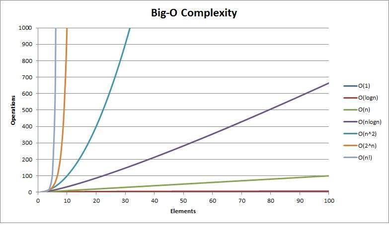

# 复杂度分析

## 1.复杂度分析是什么？

​	复杂度分析也称`大O标记法`，用于表示代码随着量级`n`增长而增长的趋势，它是在编写代码阶段，初步初略估算代码效率的表示方法。

​	复杂度分析，可以分为时间、空间两个维度进行分析。

​	它可以有效地在编码阶段评估一段代码的执行效率，在编码阶段更好的优化代码。

## 2.复杂度分析的基本法则

- #### 只关注执行时间最长的代码

  在评估一段代码的执行效率时，**大O标记法一般只关注时间复杂度最高的部分**，作为标记一段代码的复杂度，并且**常量与常数一般忽略不计**（在一定量级的执行次数时，常量几乎不影响代码整体效率）。

  比如一段最基础的代码

  ```c
  int a = 0;
  int b = 0;
  for(; a<10; a++){
    printf('hello')
  }
  for(; b<n; b++){
    printf('world')
  }
  ```

  **按照完整流程估算**，这段代码的执行效率计算为`1+1+10+10+n+n = 22+2n`，常量以及常数可以忽略不计，所以这段的复杂度表示为`O(n)`

  **按照法则**，只关注执行时间最长的代码，那么我们只关注循环n次的循环部分，那么分析起来就容易了许多，如分析以上代码，一共执行了`2n`次，常数忽略不计，那么复杂度即表示为`O(n)`

- #### 乘法法则（函数嵌套，复杂度相乘）

  在分析函数嵌套执行时的复杂度时，我们关注每个函数中复杂度最高的代码作为该段代码的复杂度，整体复杂度就相当于函数复杂度的相乘。如果一头雾水那么我们直接上例子。

  ```c
  void add (int n) {
    int i;
    for(i=0; i<n; i++){
      sum = sum + i;
    }
    return sum;
  }
  void main () {
    int res = 0;
    int i;
    for(i=0; i<n; i++) {
      res = res + add(i);
    }
  }
  ```

  我们**不需要对代码进行理解**，只需要按照法则，对上述代码进行复杂度分析，首先按照法则我们只关注代码复杂度最高的循环体部分，**add函数的复杂度为`O(n)`**，main函数，**不调用嵌套函数**的情况下，复杂度为`O(n)`，当代码执行时，**整体的复杂度为`O(n)*O(n) = O(n²)**`，所以此段代码的复杂度为`O(n²)`。

## 3.常见的复杂度类型

### 时间复杂度类型

| 复杂度类型 | 复杂度名称 | 大O标记表示法 |
| ---------- | ---------- | ------------- |
| 多项式量级 | 常量阶     | O (1)         |
|            | 对数阶     | O (log n)     |
|            | 线性阶     | O (n)         |
|            | 线性对数阶 | O (n log n)   |
|            | 平方阶     | O (n²)        |
|            | 立方阶     | O (n³)        |
|            | 多次方阶   | O (n<sup>k</sup>)        |
| 非多项式量级 | 指数阶 | O (2<sup>n</sup>) |
| | 阶乘阶 | O (n!) |

### 时间复杂度线性表示



### 常见时间复杂度分析

- #### `O(1)`

  常量级时间复杂度表示，只要是常量级的代码，代码执行时间不会随着n的不断增大而增大，则称为`O(1)`，一般不存在循环、递归语句，时间复杂度都为`O(1)`。

  ```c
  int i = 8;
  int j = 6;
  int sum = i + j;
  ```

  

- #### `O(logn)`

  在分析对数阶时间复杂度之前，我们需要了解指数函数以及对数函数的概念。

  - **指数函数**
    $$
    f(x)=a^x (a > 0 且 a ≠ 1)
    $$
    指数函数描述的事件是：以`a`增长速度，随着时间`x`的变化，总数量趋势。

    参数`a`：增长速度。

    参数`x`：时间。

    参数`f(x)`：表示随时间变化，总数量的变化趋势。

    

  - **对数函数**
    $$
    f(x)=\log_a x
    $$
    对数函数描述的事件是：根据a增长速度，随着x数量的变化，消耗时间的趋势。

    参数`a`：增长速度。

    参数`x`：总数量。

    参数`f(x)`：表示随总数量变化，时间发生的变化趋势。

    

  - **指数函数与对数函数互为反函数**

    转换公式：
    $$
    y = a^x   \Leftrightarrow   x=\;log_ay
    $$

  

  有了以上的基础数学知识，就不难学会相关的时间复杂度分析了。

  那么我们开始分析一下`O(log n)`时间复杂度的例子吧！

  ```c
  int i = 1;
  while(i <= n) {
    i = i * 2;
  }
  ```

  你可以发现，这个例子单纯看循环是很难看出它会执行多少次，那么我们只能一步一步分析它执行过程，得到它的时间复杂度了。

  | 第1次 | 第2次 | 第3次 | 第 4 次 | 第..次 | 第x次         |
  | ----- | ----- | ----- | ------- | ------ | ------------- |
  | 1     | 2     | 4     | 8       | ...    | 2<sup>x</sup> |

  所以当`i=n`时，得到公式，表示
  $$
  2^x = n
  $$
  ，我们要求的是执行次数`x`与`n`的关系，根据转换公式可以得到
  $$
  x=\log_2 n
  $$
  由于换底公式的存在，log的底数不影响对数的大小，所以底数也忽略不计，大O表示法，表示为`O(log n)`。

  

  再来一个例子

  ```c
  int i = 1;
  while(i <= n) {
    i = i * 3;
  }
  ```

  同样的分析方法，最后得到的时间复杂度为`O(log n)`

- #### `O(n·logn)`

  既然我们从上述文章中了解了`O(log n)`，我们也不难推断出`O(n·logn)`复杂度的代码形式，其实就是循环执行n遍的`O(log n)`。

  ```c
  int k = 0;
  while(k<n){
    int i = 1;
    while(i <= n) {
      i = i * 2;
    }
    k++;
  }
  ```

  

- #### O(m+n)、O(m*n)

  当代码复杂度**由两个数据的规模决定**时，那么我们就要进行相加或相乘来计算两个规模的复杂度了。

  ```c
  int cal(int m, int n) {
    int sum_1 = 0;
    int i = 1;
    for (; i < m; ++i) {
    sum_1 = sum_1 + i;
    }
    int sum_2 = 0;
    int j = 1;
    for (; j < n; ++j) {
    sum_2 = sum_2 + j;
    }
    return sum_1 + sum_2;
  }
  ```

  

## 4.空间复杂度分析

当我们已经了解了时间复杂度的概念，我们会发现空间复杂度的分析也大体相同，只是一个是分析时间的，一个是**分析占用空间**的。

例如开辟了一个空间为n的数组，那么我们的空间复杂度就为`O(n)`

**较常见的空间复杂度，就是`O(1)、O(n)、O(n²)**`