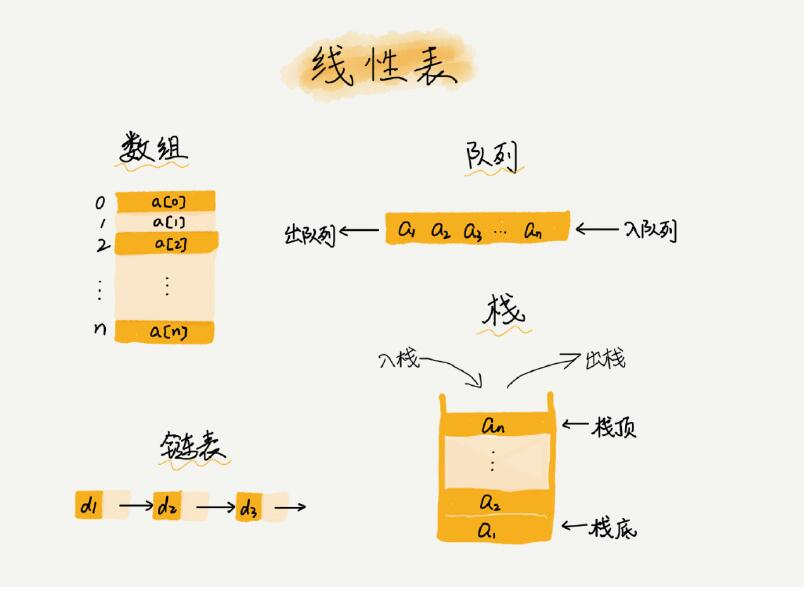
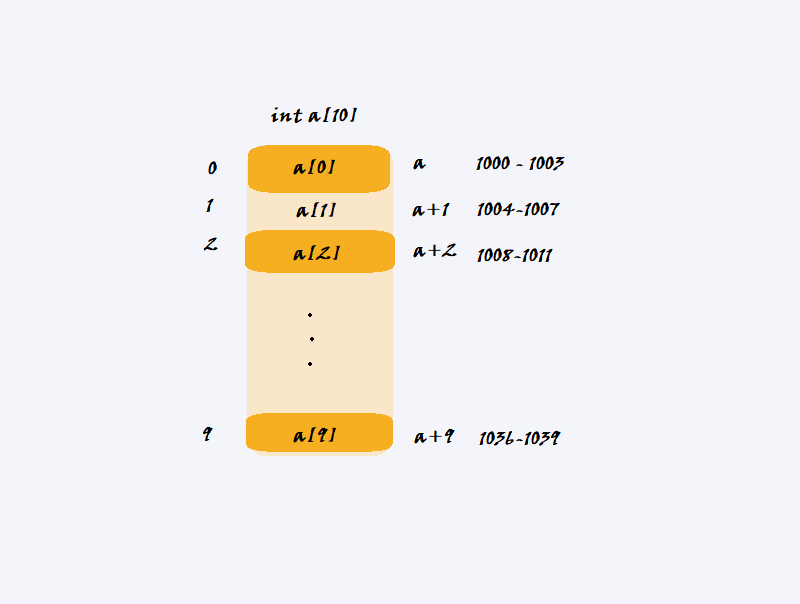
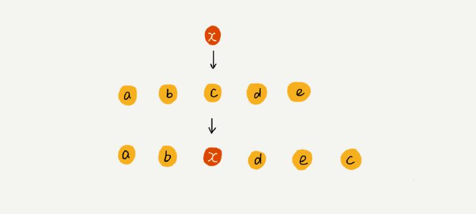
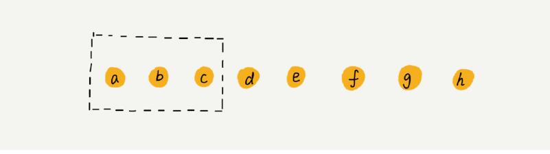

# 数据结构之线性表结构

## 1.线性表结构

线性表结构，就是**数据以一条线的方式相互联系**，只存在前后方向。数组是最容易理解的一种线性结构了。在数据结构中，**数组、链表、队列、栈**都是属于线性表结构。




## 2.数组

- ### 数组的概念

  数组的概念是一种**线性表数据结构**，**它用一组连续的内存空间，存储一组具有相同类型的数据。**

  

- ### 数组的存储结构

  数组的存储结构，是在内存开辟一段**连续且指定大小**的空间，存储**类型相同**的数据的数据结构。

  例如`int a[10] = {0};`这一句代码，开辟了长度为10的内存空间，存储int类型的数据，并初始化数据为0，存储结构如下图所示。

  

  其中左边代表在数据结构中的偏移量，右边代表了地址。在图中不难看出，数组是连续存储的，为了方便查询，其数据类型也需要统一，查询时计算机会根据数据类型进行地址的寻址，公式如下

  ```c
    内存地址   =   初始地址    + 偏移量 * 数据类型大小
  a[i]_address = base_address + i * data_type_size
  ```


- ### 数组的优点

  在我们分析了数组的存储结构之后，我们就可以发现，它具备三个特性

  - **数组数据连续存放在一片内存区域。**
  - **数组大小必须确定‘。**
  - **数组的数据类型必须相同。**

  这三个特性，有利于我们进行数组下标进行数据查询。例如在`a[10]`中，初始地址`a`为`1000`，那么我们要访问`a[2]`是非常简单的运算，只需要根据寻址公式计算得到从1008开始访问4个字节，就可以查询到`a[2]`的数据，整体花费的时间复杂度为`O(1)`。

  所以我们可以总结**数组的优点**：

  1. ##### 数组支持通过下标随机访问。

  2. ##### 查询成员快——数组通过下标访问数组成员的时间复杂度为O(1)。

  

- ### 数组的缺点

  当然，数组也不是尽善尽美的，它的优点，也成为了它的缺点，因为你想想，如果把数据连续存储时，我们要对**数组进行插入、删除**，又要**保证它的连续性**，是不是就出现问题了？

  1. #### 插入/删除操作，为了保证连续性，需要进行大量操作进行数据移位。

     如果数据结构存储是**有顺序**的，当我们需要插入/删除时，为了保证数据是连续的，那么我们不可避免，要进行搬移数据的操作。

     例如，从`a[3]=[1, 3, 4];`插入数字`2`在下标为`1`的位置，那么我们要先把`3、4`都往后移动一位。

     当存在`a[n]`数组，要插入数据如下标为`k`的位置，利用大O表示法，其最好时间复杂度为`O(1)`，最坏要进行`O(n)`。

     **可以优化的空间**

     - **非有序插入操作**

       插入操作，不需要有序时，可以直接将位置的数据存储到数组末尾，再把目标数据存入指定位置。大大节省了数据搬移耗费的时间。

       

     - **删除操作的标记清除法**

       进行删除操作时，可以先标记记录已经删除的数据，当数组没有更多空间存储数据时，触发统一删除操作，避免每删除一个都需要耗费大量操作进行数据搬移操作。

       

       

  2. #### 访问越界，造成BUG

     在数组结构中，因为数组是需要指定大小的，在一些内存地址开放访问的语言中（如C语言），发生内存越界时，会产生BUG，所以必须注意访问边界的问题。

  

- #### 容器 VS 数组

  容器是将数组操作封装起来，使我们可以不用进行大量重复操作数组进行的编码工作，并且很多语言中数据都支持**动态扩容**（存储结构不够大时，自动扩充）。

  相对于数组来说，高级语言进行业务开发时通常会使用容器，因为牺牲几乎可以忽略的性能，就可以换来更多时间关注业务，何乐而不为呢。

  但是进行偏底层的编码来说，要追求极致的性能，数组就更加适合。

- #### 有趣的思考

  - 为什么数组从下标0开始？

    数组的下标值，代表了偏移量，我们计算内存地址的公式

    ```c
    a[i]_address = base_address + i * data_type_size
    ```

    如果从下标1开始的话，我们每次计算地址值都需要进行偏移值重新计算。

    ```c
    a[i]_address = base_address + (i-1) * data_type_size
    ```

    那么对于计算机来说，每次操作都需要增加一个减法操作，性能自然会有所下降。

## 3.链表


## 4.队列

## 5.栈

