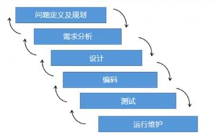
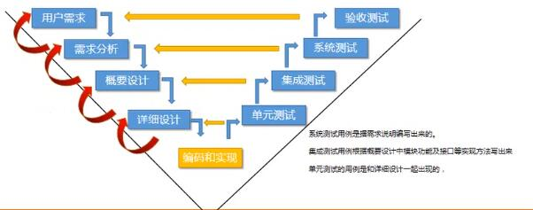
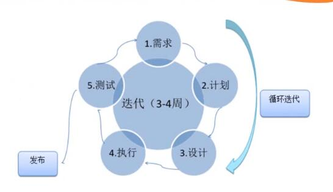

# 软件测试基础

##  1.软件测试是什么？

- ### 软件测试的定义

  为了发现程序中的错误而执行的程序过程。

- ### 软件测试的目的

  1. 发现软件存在的代码或业务逻辑的错误
  2. 检验是否符合用户需求
  3. 提高用户的产品体验

## 2.软件测试的原则

1. 测试尽早接入
2. 所有测试都应该追溯到用户需求
3. 程序员避免检测自己的程序，除了单元测试。
4. 设计测试用例应 考虑合法输入以及不合法输入、考虑各种边界，特殊情况下还要制造极端和意外状态进行测试。
5. 二八原则，测试发现的错误中80%可能起源于20%模块中。
6. 对错误结果要进行一个确认过程。
7. 指定严格的测试计划
8. 完全测试是不可能的，测试需要终止
9. 妥善保存测试过程中的所有文档

## 3.软件测试的分类

1. #### 按照测试执行阶段划分

   - ##### 单元测试

     测试单个模块功能

   - ##### 集成测试

     测试多个模块集成后的功能

   - ##### 系统测试

     测试整个流程进行测试

   - ##### 验收测试（正式验收测试、Alpha测试、Beta测试）

     Alpha测试：用户在开发环境中测试。

     Beta测试：用户实际使用情况下测试

2. #### 按测试技术划分

   - ##### 白盒测试

     测试代码逻辑。

   - ##### 黑盒测试

     在不知道代码逻辑的情况下，测试功能。

   - ##### 灰盒测试

     检测代码逻辑以及功能测试。

3. #### 按照被测试对象进行划分

   - ##### 动态测试

     运行程序时进行测试。

   - ##### 静态测试（文档检查、代码走查、界面检查）

     不执行程序时进行测试。

4. #### 按照不同的测试手段划分

   - ##### 手工测试

   - ##### 自动化测试

5. #### 按照测试包含内容进行划分

   大多都同名字差不多，对于一样商品基本的测试。

   - ##### 功能测试

   - ##### 界面测试

   - ##### 安全测试

     SQL注入攻击测试、前端的XSS攻击。

   - ##### 兼容性测试

     环境兼容性测试。

   - ##### 易用性测试

   - ##### 性能测试

   - ##### 压力测试

   - ##### 负载测试

   - ##### 恢复测试

6. #### 其他测试划分

   - ##### 冒烟测试

     主流程是否能走通。

   - ##### 回归测试

     出现问题，回馈修改之后，再验证。

   - ##### 探索性测试/自由测试

## 3.软件测试的生命周期

- ### 瀑布型声明周期模型（周期较长）

  每个生命周期自上而下的执行，按照顺序 ==逐级进行==。具备顺序性以及依赖性，每个阶段规定文档并进行评审。

  

- ### V模型（开发效率高）

  V模型，开发生命周期呈现V字型，在开发初期分为四个阶段，用户提出需求，做初步需求分析后，进行概要设计，之后进行详细的设计，再交给程序员进行开发工作。开发工作的同时，测试人员按阶段性反馈测试，在模块完成后进行单元测试，多模块组合的集成测试，之后在系统完成后，按照需求分析，进行综合的系统测试，最后进行用户需求的验收测试。期间程序员和测试人员可以同期进行工作，开发效率高，缺点是业务需求的测试进行较晚，如果功能开发不符合需求，就要重新进行之前的步骤。

  

- ### 敏捷开发模型（成品快，不断迭代）

  #### 生命周期： 产品需求 - 开发 - 测试

  #### 

## 4.软件测试的测试流程

### 开发流程

1. #### 需求分析

   通过调研，市场是否有需求。

2. #### 需求评审

   提出问题/异议。

3. #### 编写开发计划

   负责人计划，需要多少人，多少时间。

4. #### 概要设计、详细设计

   进行相关的设计，数据库，架构，功能等等。

5. 开发人员代码编写以及自测

6. ### 提交代码

### 测试流程

1. #### 从编写开发计划开始，编写测试计划

2. #### 编写测试用例

3. #### 测试用例评审

4. #### 部署测试环境

5. #### 冒烟测试、正式测试

6. #### 提交bug并追踪测试

7. #### 测试通过

8. #### 发布上线

## 5.软件测试的五个阶段

### 工作流程概括梳理：需求评审->编写测试用例->评审用例->搭建测试环境->等待开发 提交测试包->部署测试包->冒烟测试->执行测试用例->bug跟踪处理-> n轮测试 -> 版本上线

- ### 测试需求分析阶段

  分析需求分析，理解需求。

- ### 测试计划阶段

  编写测试计划

- ### 测试设计阶段

  编写测试用例，参考需求文档、概要设计、详细设计等文档，有不明确需要和开发以及产品经理进行沟通。

- ### 测试执行阶段

  搭建测试环境，进行主程序是否可以通过（冒烟）。通过后进行系统的测试，以及bug的跟踪测试，直到软件测试达到要求。

- ### 测试评估阶段

## 6.编写测试用例的方法

- ### 等价类划分法（有用户输入）

  典型的黑盒测试方法，它可以按照==数据范围==或者==数据类型==划分成==有效等价类==和==无效等价类==.

  - 测试用例原则
    1. 划分的有效/无效等价类，都为其设计唯一的编号。
    2. 只要有效等价类被覆盖，用例写得越少越好。
    3. 每一个无效等价类都是一个用例。

- ### 边界值分析法

  边界值分析，关注测试边界，开发容易出问题。分为==正好等于、刚刚大于、刚刚小于==的

  

- ### 场景法

  通过模拟用户正确及错误操作流程。验证软件的系统功能的正确性。

  

- ### 错误推测法

  根据经验，知识，直觉进行测试。

## 7.测试方法的选择

- 进行等价类划分
- 进行边界值分析法
- 用错误推测法追加测试用例
- 对照程序逻辑，检测测试用例的覆盖程度。

## 9.测试用例编写

- 根据需求文档分析出测试点

  --输入、输出、处理、限制、约束等功能测试

  --各个模块业务顺序

  --存在交互的功能进行测试（功能交互测试）。

  --界面验证，注册账号唯一性测试、安全性、兼容性、易用性、性能压力等测试

- ### 测试用例编写八大要素

  - ### ==用例编号==

    

  - ### ==测试项目==

  - ### ==测试标题==

  - ### 重要级别

  - ### 预置条件

  - ### ==测试输入==

  - ### ==操作步骤==

  - ### ==预期结果==

  - ### ==实际结果==